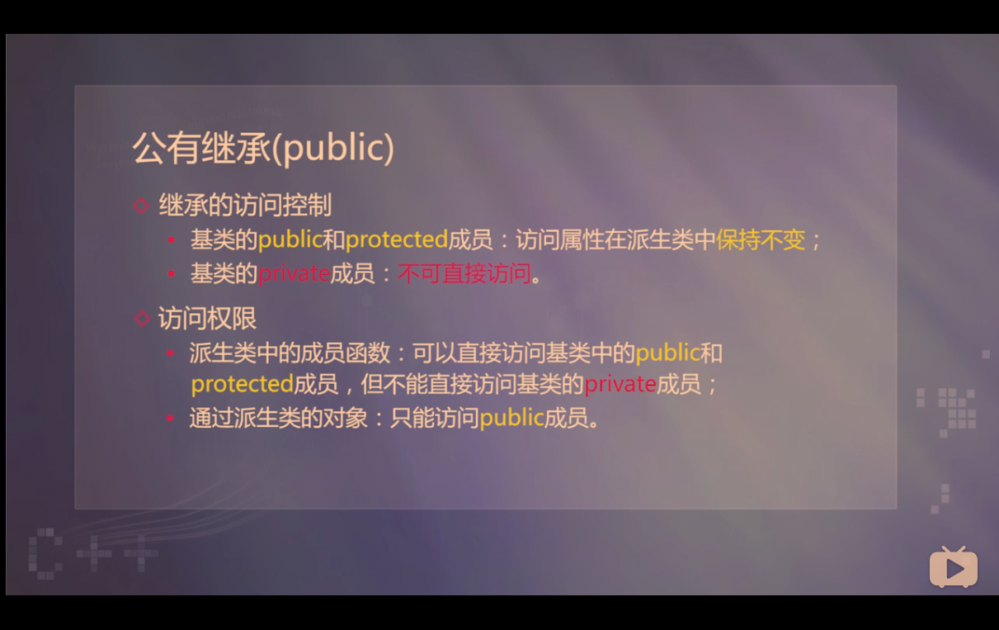
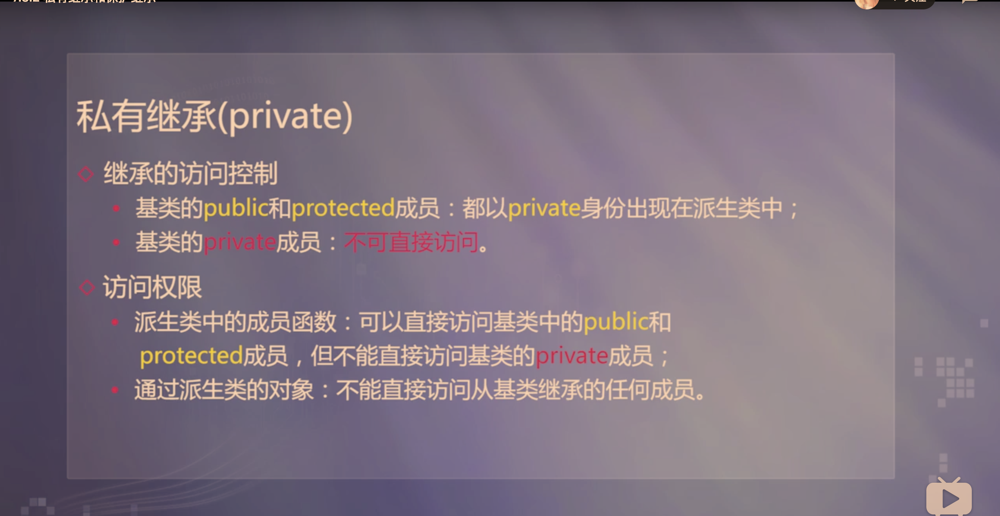
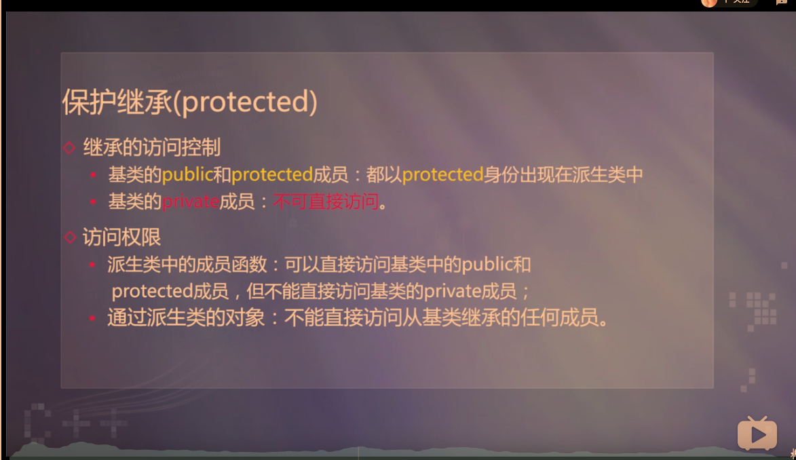

- 吸收基类成员
    - 默认情况下派生类包含了全部基类中除构造和析构函数之外的所有成员
    - c++ 11规定可以用using语句继承基类构造函数，但是只能初始化从基类继承的成员
- 改造基类成员
  - 如果派生类声明了一个和某基类成员同名的新成员，派生的新成员就隐藏或覆盖了外层同名成员
- 公有继承

- 私有继承

- 保护继承

  - 保护成员的特点与作用
    - 对建立其所在类对象的模块来说，它与private成员的性质相同
    - 对于其派生类来说，它与public成员的性质相同
    - 既实现了数据隐藏，又方便继承，实现代码重用
- 派生类与基类的构造函数
  - 当基类有默认构造函数时
    - 派生类构造函数可以不向基类构造函数传递参数
    - 构造派生类的对象时，基类的默认构造函数将被调用
  - 如果基类中是带参数的构造函数
    - 派生类构造函数应为基类构造函数提供参数

- 构造函数的执行顺序
  - 调用基类构造函数
    - 顺序按照它们被继承时声明的顺序（从左向右）
  - 对初始化列表中的成员进行初始化
    - 顺序按照它们在类中定义的顺序
    - 对象成员初始化时自动调用其所属类的构造函数
      - 由初始化列表提供参数
  - 执行派生类的构造函数体中的内容