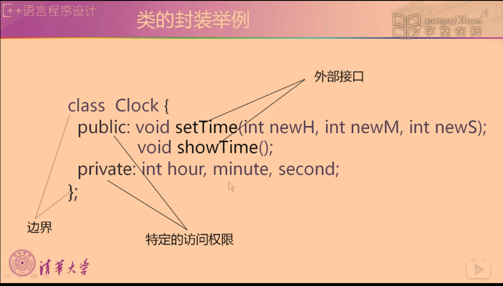

- [抽象](#抽象)
- [封装](#封装)
- [继承](#继承)
- [多态](#多态)

#### 抽象
  - 概念
    - 对同一类对象的共同属性和行为进行概括，形成类
  - 首先注意问题的本质及描述，其次是实现的过程及细节
  - 数据抽象
    - 描述某类对象的属性或状态（对象相互区别的物理量）
  - 代码抽象
    - 描述某类对象的共有的行为特征或具有的功能
  - 抽象的实现：类
  - 实例
    - 钟表
        - 数据抽象
          - `int hour`, `int minute`, `int second`
        - 代码抽象
          - `setTime()`, `showTime()`
#### 封装
  - 概念
    - 将抽象出的数据成员、代码成员相结合，将它们视为一个整体
  - 目的
    - 增强安全性和简化编程，使用者不必了解具体的实现细节，而只需要通过外部接口，以特定的访问权限，来使用类的成员
  - 实现封装
    - 类声明中的`{}`
- 类的封装举例
    
#### 继承
  - 概念
    - 在已有类的基础上，进行扩展形成新的类
#### 多态
  - 概念
    - 同一名称，不同的功能实现方式
  - 目的
    - 达到行为标识统一，减少程序中标识符的个数
