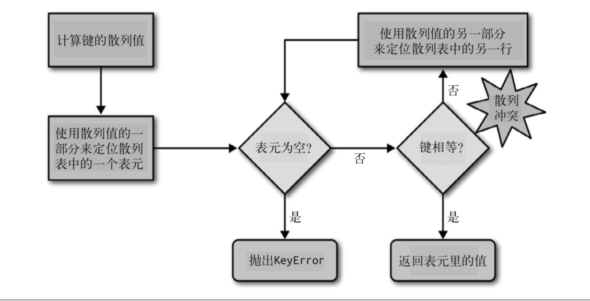

- [python中的散列表](#python%e4%b8%ad%e7%9a%84%e6%95%a3%e5%88%97%e8%a1%a8)
- [dict](#dict)
- [set](#set)
#### python中的散列表
* 散列表其实是一个稀疏数组(总是有空白元素的数组称为稀疏数组)。在一般的数据结构 教材中，散列表里的单元通常叫作表元(bucket)。在 dict 的散列表当中，每个键值对都 占用一个表元，每个表元都有两个部分，一个是对键的引用，另一个是对值的引用。因为 所有表元的大小一致，所以可以通过偏移量来读取某个表元。
* 因为 Python 会设法保证大概还有三分之一的表元是空的，所以在快要达到这个阈值的时 候，原有的散列表会被复制到一个更大的空间里面。
* 如果要把一个对象放入散列表，那么首先要计算这个元素键的散列值。Python 中可以用 hash() 方法来做这件事情，接下来会介绍这一点。
* 散列值和相等性
  * 内置的 hash() 方法可以用于所有的内置类型对象。如果是自定义对象调用 hash() 的话， 实际上运行的是自定义的 \_\_hash__。如果两个对象在比较的时候是相等的，那它们的散列 值必须相等，否则散列表就不能正常运行了。例如，如果 1 == 1.0 为真，那么 hash(1) == hash(1.0) 也必须为真，但其实这两个数字(整型和浮点)的内部结构是完全不一样的。9
  * 为了让散列值能够胜任散列表索引这一角色，它们必须在索引空间中尽量分散开来。这意 味着在最理想的状况下，越是相似但不相等的对象，它们散列值的差别应该越大。示例 3-16 是一段代码输出，这段代码被用来比较散列值的二进制表达的不同。注意其中 1 和 1.0 的散列值是相同的，而 1.0001、1.0002 和 1.0003 的散列值则非常不同。
* 从 Python 3.3 开始，str、bytes 和 datetime 对象的散列值计算过程中多了随 机的“加盐”这一步。所加盐值是 Python 进程内的一个常量，但是每次启动 Python 解释器都会生成一个不同的盐值。随机盐值的加入是为了防止 DOS 攻 击而采取的一种安全措施。
* 散列表算法
  * 为 了 获 取 my_dict[search_key] 背 后 的 值，Python 首 先 会 调 用 hash(search_key) 来 计 算 search_key 的散列值，把这个值最低的几位数字当作偏移量，在散列表里查找表元(具 体取几位，得看当前散列表的大小)。若找到的表元是空的，则抛出 KeyError 异常。若不 是空的，则表元里会有一对found_key:found_value。这时候Python会检验search_key == found_key 是否为真，如果它们相等的话，就会返回 found_value。
  * 如果 search_key 和 found_key 不匹配的话，这种情况称为散列冲突。发生这种情况是因 为，散列表所做的其实是把随机的元素映射到只有几位的数字上，而散列表本身的索引又 只依赖于这个数字的一部分。为了解决散列冲突，算法会在散列值中另外再取几位，然后 用特殊的方法处理一下，把新得到的数字再当作索引来寻找表元。10 若这次找到的表元是 空的，则同样抛出 KeyError;若非空，或者键匹配，则返回这个值;或者又发现了散列冲 突，则重复以上的步骤。如图所示：
  
  * 添加新元素和更新现有键值的操作几乎跟上面一样。只不过对于前者，在发现空表元的时候会放入一个新元素;对于后者，在找到相对应的表元后，原表里的值对象会被替换成新值。
  * 另外在插入新值时，Python 可能会按照散列表的拥挤程度来决定是否要重新分配内存为它 扩容。如果增加了散列表的大小，那散列值所占的位数和用作索引的位数都会随之增加， 这样做的目的是为了减少发生散列冲突的概率。
  * 表面上看，这个算法似乎很费事，而实际上就算 dict 里有数百万个元素，多数的搜索过程中并不会有冲突发生，平均下来每次搜索可能会有一到两次冲突。在正常情况下，就算是最不走运的键所遇到的冲突的次数用一只手也能数过来。
#### dict
* 键必须是可散列的。
  * 一个可散列的对象必须满足以下要求:
     * 支持 hash() 函数，并且通过 \_\_hash__() 方法所得到的散列值是不变的。  
     * 支持通过 \_\_eq__() 方法来检测相等性。
     * 若 a == b 为真，则 hash(a) == hash(b) 也为真。
  * 所有由用户自定义的对象默认都是可散列的，因为它们的散列值由 id() 来获取，而且它们 都是不相等的。
  * 如果你实现了一个类的 \_\_eq__ 方法，并且希望它是可散列的，那么它一定要 有个恰当的 \_\_hash__ 方法，保证在 a == b 为真的情况下 hash(a) == hash(b) 也必定为真。否则就会破坏恒定的散列表算法，导致由这些对象所组成的字 典和集合完全失去可靠性，这个后果是非常可怕的。另一方面，如果一个 含有自定义的 \_\_eq__ 依赖的类处于可变的状态，那就不要在这个类中实现 \_\_hash__ 方法，因为它的实例是不可散列的。
* 字典在内存上的开销巨大
  * 由于字典使用了散列表，而散列表又必须是稀疏的，这导致它在空间上的效率低下。举例 而言，如果你需要存放数量巨大的记录，那么放在由元组或是具名元组构成的列表中会是 比较好的选择;最好不要根据 JSON 的风格，用由字典组成的列表来存放这些记录。用元 组取代字典就能节省空间的原因有两个:其一是避免了散列表所耗费的空间，其二是无需 把记录中字段的名字在每个元素里都存一遍。
  * 在用户自定义的类型中，\_\_slots__ 属性可以改变实例属性的存储方式，由 dict 变成 tuple，相关细节在 9.8 节会谈到。
  * 记住我们现在讨论的是空间优化。如果你手头有几百万个对象，而你的机器有几个 GB 的 内存，那么空间的优化工作可以等到真正需要的时候再开始计划，因为优化往往是可维护 性的对立面。
* 键查询很快
  * dict 的实现是典型的空间换时间:字典类型有着巨大的内存开销，但它们提供了无视数据 量大小的快速访问——只要字典能被装在内存里。正如表 3-5 所示，如果把字典的大小从 1000 个元素增加到 10 000 000 个，查询时间也不过是原来的 2.8 倍，从 0.000163 秒增加到了 0.00456 秒。这意味着在一个有 1000 万个元素的字典里，每秒能进行 200 万个键查询。
* 键的次序取决于添加顺序
  * 当往 dict 里添加新键而又发生散列冲突的时候，新键可能会被安排存放到另一个位置。 于是下面这种情况就会发生:由dict([key1, value1), (key2, value2)]和dict([key2, value2], [key1, value1])得到的两个字典，在进行比较的时候，它们是相等的;但是如 果在 key1 和 key2 被添加到字典里的过程中有冲突发生的话，这两个键出现在字典里的顺 序是不一样的。
* 往字典里添加新键可能会改变已有键的顺序
  * 无论何时往字典里添加新的键，Python 解释器都可能做出为字典扩容的决定。扩容导致的 结果就是要新建一个更大的散列表，并把字典里已有的元素添加到新表里。这个过程中可能会发生新的散列冲突，导致新散列表中键的次序变化。要注意的是，上面提到的这些变 化是否会发生以及如何发生，都依赖于字典背后的具体实现，因此你不能很自信地说自己 知道背后发生了什么。如果你在迭代一个字典的所有键的过程中同时对字典进行修改，那 么这个循环很有可能会跳过一些键——甚至是跳过那些字典中已经有的键。
  * 由此可知，不要对字典同时进行迭代和修改。如果想扫描并修改一个字典，最好分成两步 来进行:首先对字典迭代，以得出需要添加的内容，把这些内容放在一个新字典里;迭代 结束之后再对原有字典进行更新。
#### set
* set 和 frozenset 的实现也依赖散列表，但在它们的散列表里存放的只有元素的引用(就 像在字典里只存放键而没有相应的值)。在 set 加入到 Python 之前，我们都是把字典加上 无意义的值当作集合来用的。
* 为了避免 太多重复的内容，这些特点总结如下:
  * 集合里的元素必须是可散列的。
  * 集合很消耗内存。
  * 可以很高效地判断元素是否存在于某个集合。
  * 元素的次序取决于被添加到集合里的次序。
  * 往集合里添加元素，可能会改变集合里已有元素的次序。
