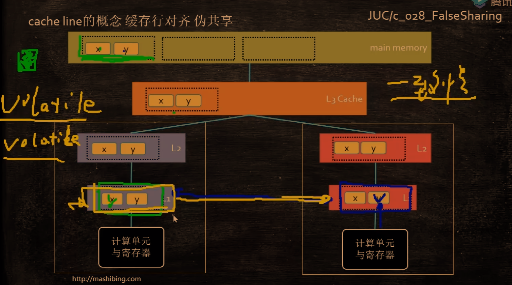
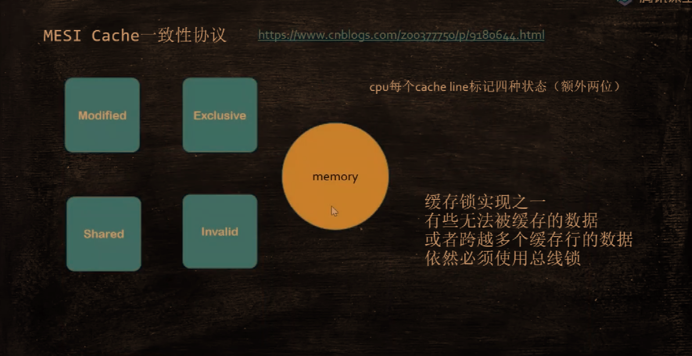

由于局部性原理，cpu会一次读取cache line大小的数据：

缓存行越大，局部性空间效率越高，但读取时间慢；缓存行越小，局部性空间效率越低，但读取时间快。取一个折中值，目前多用：64bytes

由于cache line中的数据可能会被修改，导致两个或多个核中的同一个cache line不一致，所以会使用缓存一致性协议保证一致性：

注意：有些无法被缓存的数据或者跨越多个缓存行的数据依然必须使用总线锁